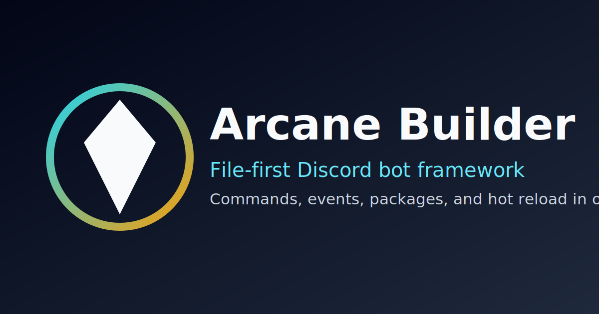

# Arcane Builder

Arcane Builder is a JSON-first framework and CLI for shipping Discord bots with predictable structure.

## What You Get

- `commands/`, `events/`, and `packages/` are first-class runtime inputs
- Slash commands and text commands from a shared command definition model
- Component interactions (buttons and select menus) with template-aware responses
- JSON-configured event execution, including `once` listeners and package-backed handlers
- Hot reload in `arcane dev` with command re-sync and event rebinding
- Strict preflight validation before deployment

## Read This First

1. `getting-started/installation.md`
2. `getting-started/quickstart.md`
3. `guide/project-setup.md`
4. `guide/command-workflow.md`
5. `guides/events.md`

## Production Baseline

1. Keep `settings.devGuild` set while iterating commands.
2. Run `arcane validate --strict` before every deploy.
3. Use `arcane deploy --pm2 --name arcanebuilder` for long-running processes.

## Documentation Layout

- Getting Started: install, bootstrap, first run
- Concepts: architecture, config model, lifecycle
- Guide: implementation workflows
- Packages: official package references
- API: command/config/package references
- Reference: troubleshooting, FAQ, roadmap

  
<strong>Packages Dropdown</strong>

  - [Packages Overview](packages/index.md)
  - [@arcane/moderation](packages/moderation.md)
  - [@arcane/music](packages/music.md)
  - [@arcane/leveling](packages/leveling.md)

