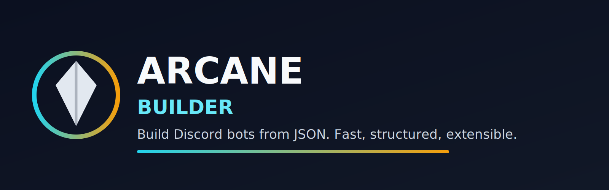

# Arcane Builder

Made by Ramkrishna.

Build Discord bots from JSON with a CLI-first workflow.



## What Makes Arcane Different

- JSON-first command, event, and package system
- Recursive config loading for large bots
- Hot reload for fast development cycles
- Validation before runtime failure
- Monorepo-ready architecture direction

## Quick Start

```bash
arcane init my-bot
cd my-bot
cp .env.example .env
arcane validate
arcane dev
```

## Core Commands

| Command | Purpose |
|---|---|
| `arcane init` | Create a new Arcane project |
| `arcane create` | Generate command/event/package config |
| `arcane dev` | Development mode with hot reload |
| `arcane validate` | Validate all project config |
| `arcane package` | Manage package config files |

## Read Next

- `getting-started/quickstart.md`
- `guides/configuration.md`
- `api/cli-reference.md`
- `reference/troubleshooting.md`
